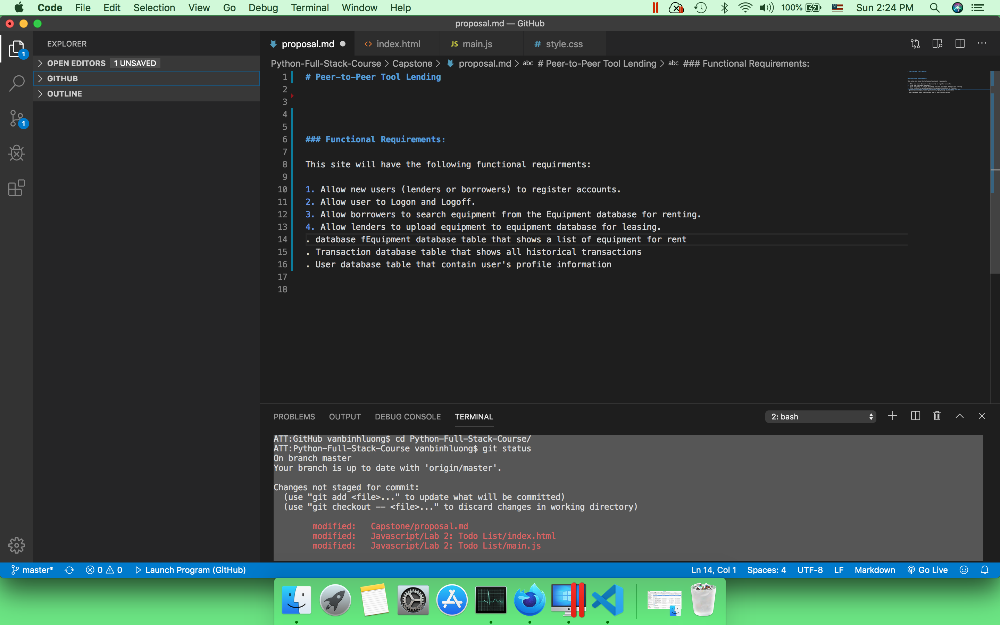

# Peer-to-Peer Tool Lending

### Project Overview

The purpose of this project is to create a peer-to-peer tool lending site. This site will allow users to lend their tools to others at a very low cost.

What's the benefit of peer-to-peer tool lending program? Here are the benefits: 
    (1) Cost of renting a tool can be lower comparing to other local tool rental companies.
    (2) Tool owners can make extra money from renting out their tools. 
    (3) You can still lend tools to your friends or family with this system. With this system, you have them accountable for what they're borrowing. 

### Project Scope

The scope of this project will consist of the following functional requirments: 

1. Allow new users (lenders or borrowers) to register accounts. 
2. Allow users (borrowers or lenders) to Logon and Logoff. 
3. Allow borrowers to search equipment from the equipment database for renting. 
4. Allow borrowers to request an equipment for rent. 
4. Allow lenders to upload equipment to the equipment database for leasing. Provide suggested leasing price based on the existing market
5. Allow lenders to accept the rental request. 
5. Create Equipment database table that shows a list of equipment for rent.
6. Create Transaction database table that shows all current and historical transactions.
7. Create User database table that contain user's profile information.

### Data model

<!--  -->

