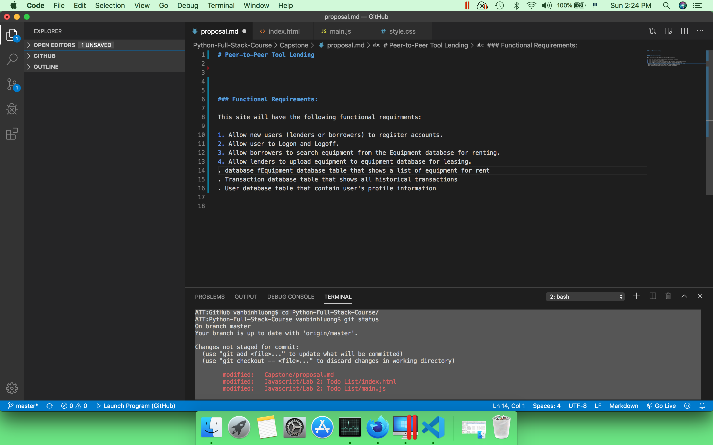

# Peer-to-Peer Tool Lending

### Functional Requirements:

This site will have the following functional requirments: 

1. Allow new users (lenders or borrowers) to register accounts. 
2. Allow user to Logon and Logoff. 
3. Allow borrowers to search equipment from the Equipment database for renting. 
4. Allow lenders to upload equipment to equipment database for leasing. 
. database fEquipment database table that shows a list of equipment for rent
. Transaction database table that shows all historical transactions
. User database table that contain user's profile information

